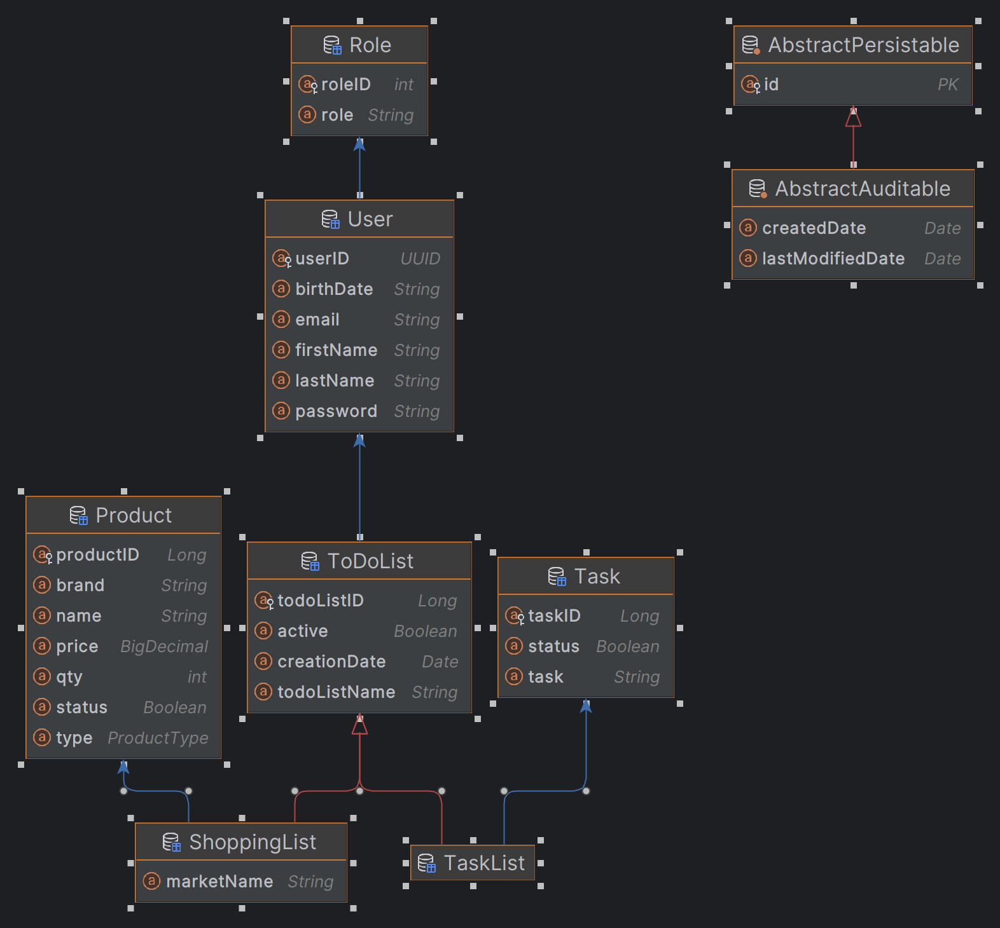

# Description of the project
The Project is mainly a Todo-List, including an Shopping List, where you can Put your 
# Class Diagram

# Setup
The Project needs a MySQL Database with name Project
# Technologies Used
# Controllers and Routes structure
The Project haves in Total 7 Controllers, one for every Table/Class

An Controller Named Admin: in this Controller a Admin can see all Users and Delete a specific one, additionally can create Roles
  routes: /admin /admin/users 
          /admin/users/{id}

A Controller for Shopping List 
  route: /todolist/shoppinglists

A Controller for the Products to be shopped
  route: /todolist/shoppinglists/{shoplistid}/product

A Controller is destined for the Task List (show Task List or Update the properties)
  route: /todolist/tasklists

A controller for Tasks in case
  route: /todolist/tasklist/idoftaslist/task

A controller for Show All Lists (Task Lists & Shopping Lists) 
  route: /todolist/

A controller for User where can Register and Update Personal Details Like Name or Birthdate
route: /users/register

# Presentation Link
https://docs.google.com/presentation/d/e/2PACX-1vQ4MyzatYmPyUV9BSf2KgvEEEDE-vI8ai_IJIxei_6VUmRdQDiIjhsbK2XNRACJWk0obLnlB-RuCSJz/pub?start=false&loop=false&delayms=3000